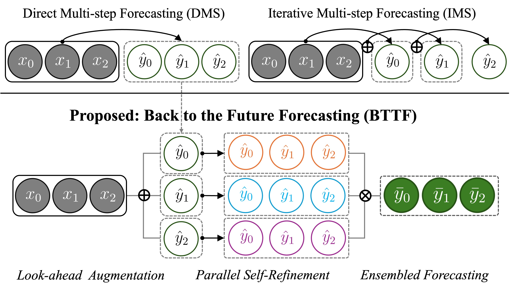
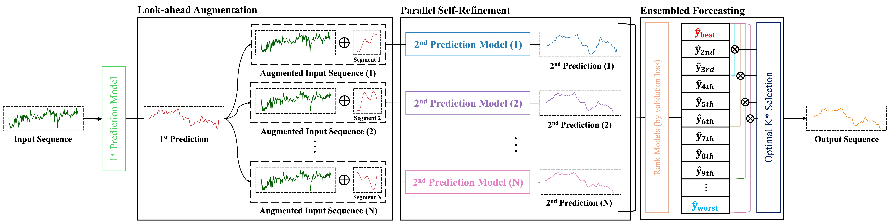

<h1 align="center">
Back to the Future: Look-ahead Augmentation and Parallel Self-Refinement for Time Series Forecasting
</h1>

<p align="center">
  
</p>

Official implementation of **Back to the Future (BTTF)**, a simple yet effective framework for **long-term time series forecasting (LTSF)** via **look-ahead augmentation**, **parallel self-refinement**, and **ensembled Forecasting**.

BTTF leverages segments of model-generated future predictions as **future-aware context**, enabling DMS-style parallelism while implicitly preserving IMS-like temporal dependencies.

<p align="center">
  
</p>
<p align="center"><em>
</em></p>


### Method Overview

BTTF is a two-stage framework that refines a base forecasting model through **future-aware augmentation** and **parallel self-refinement**, and further stabilizes predictions via a **step-wise top-K ensemble**.

#### 1) Look-ahead Augmentation
Given a first-stage forecast, the predicted horizon is split into **N segments**, each of which is appended to the original input window to form augmented inputs.

#### 2) Parallel Self-Refinement
**N independent** second-stage predictors are trained on the augmented inputs, each learning a distinct refinement pattern.

#### 3) Ensembled Forecasting
Second-stage models are ranked by validation performance, and a **step-wise top-K** ensemble is constructed by selecting the optimal $K^*$ based on variance and covariance analysis.

<p align="center">
  
</p>
<p align="center"><em>
</em></p>

### Dataset
The `/dataset` directory contains the datasets used for model training and evaluation.

# Quick Start

```bash
# Single test run
python run_parallel.py --gpus 0 --dataset etth1 --pred_len 96

# Full experiments (All Datasets & Horizon)
python run_parallel.py --gpus 0,1,2,3
```
**=> For more detailed experiment configurations, please refer to ExpDetails.md.**


   
# Citation
### If our work was helpful in your research, please kindly cite this work:

```
@article{kim2026back,
  title={Back to the Future: Look-ahead Augmentation and Parallel Self-Refinement for Time Series Forecasting},
  author={Kim, Sunho and Yoon, Susik},
  journal={arXiv preprint arXiv:2602.02146},
  year={2026}
}
```


